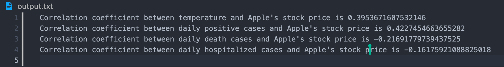
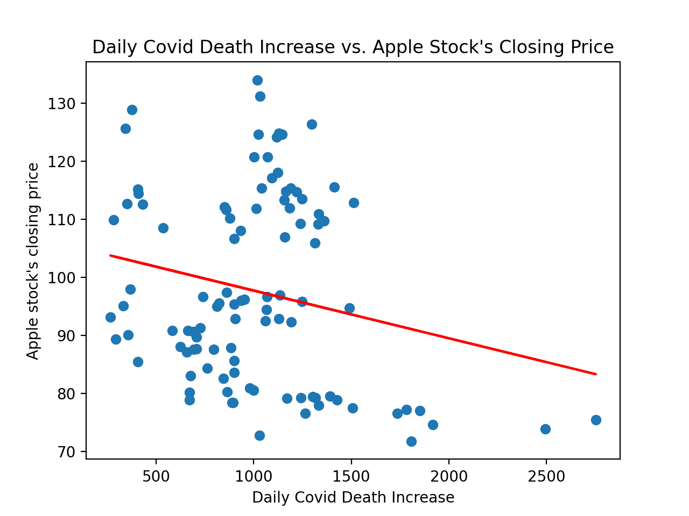
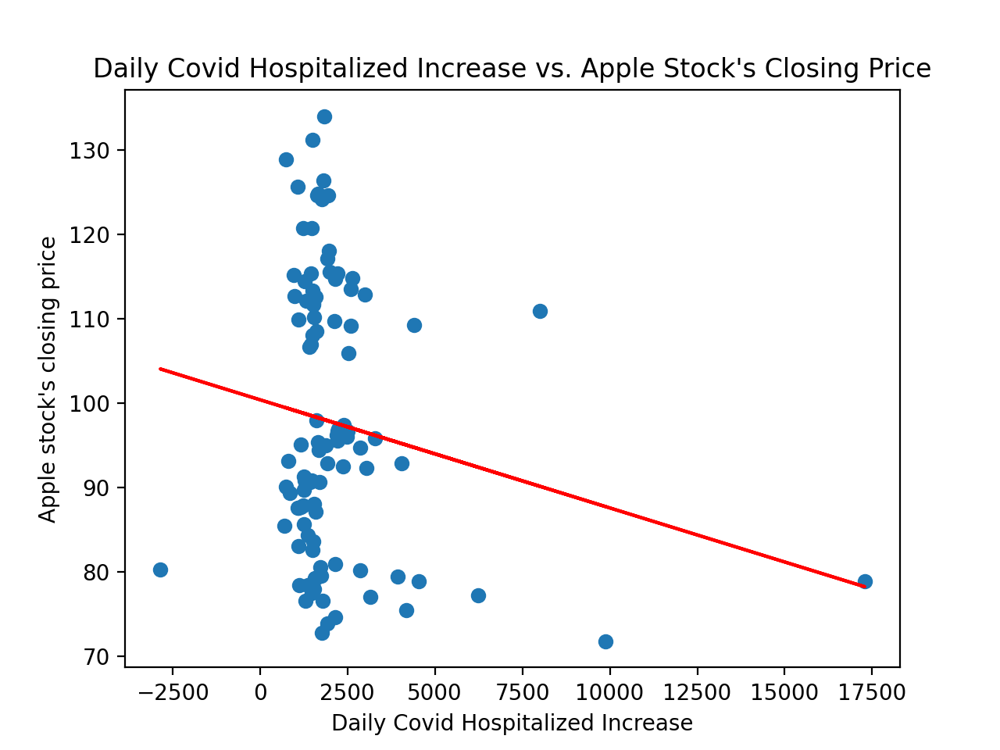
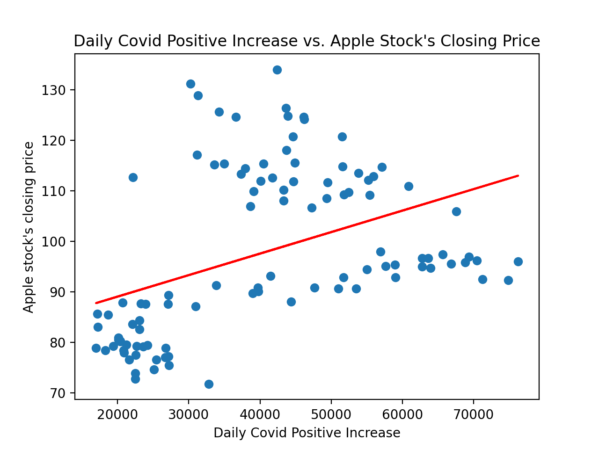
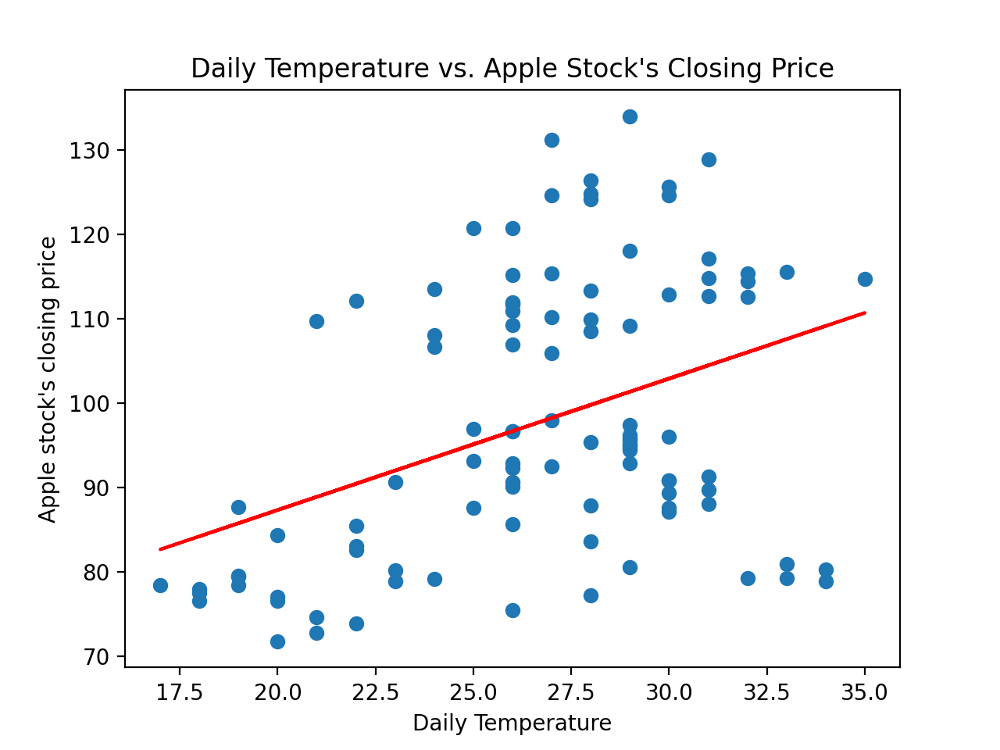

# Documentation

## 待办事项

1. WriteData.py 需要加入 check if database exists 的功能。
   - 现在情况是writedata.py如果检测到 database exists会drop database&table. 所以需要加入一个判断如果database exeists就不需要drop并且继续写的功能
2. GetStockData.py 需要加入处理异常值的功能。
   - 由于某些数据会拉取不到（周末，节假日或异常情况），json中的数据在写入database后两个table的id不能一一匹配（stock的id会缺失）
3. #这条可以忽略
   - WriteData.py 中的sql queries使用了f-string，这样写可能会受到sql injection攻击，但是因为sql query有严格的parameterization
条件，我目前还没有找到更好的办法。
4. 我们下一步是Calculation。我想用两组数据算出他们的correlation coefficient。
   - 最简单的办法是import numpy package. -->教程 <https://realpython.com/numpy-scipy-pandas-correlation-python>. 我的思路是用 for loop 把两个table中的数据拉出来存入两个 numpy array variables，然后算出correlation coefficient
5. 加入第三个API：Covid tracking --> 网站 <https://covidtracking.com/data/api>.
6. 需要写documentation。就是现在这个文件。具体内容我放到下面了。这个待办事项可以到时候删掉
7. can include boxplot

## Rubric

In addition to your API activity results, you will be creating a report for your overall project. The report must include:

1. The goals for your project (10 points)
2. The goals that were achieved (10 points)
3. The problems that you faced (10 points)
4. Your file that contains the calculations from the data in the database (10 points)
5. The visualization that you created (i.e. screen shot or image file) (10 points)
6. Instructions for running your code (10 points)
7. Documentation for each function that you wrote. This includes the input and output for
each function (20 points)
8. You must also clearly document all resources you used. The documentation should be of
the following form (20 points)

### Our Project Goals

For this project, our main goal is to explore the potential relationship between temperature of Cuppertino; daily covid positive cases; daily hospitalized covid cases; daily covid death cases and Apple company's stock price.

We use 3 APIs to gather relevant data. These APIs include

1. stock price from <https://marketstack.com/>
2. covid data from <https://covidtracking.com/data/api>
3. and weather data from <https://www.worldweatheronline.com/developer/>.

More specifically, we want to get

1. AAPL stock's closing price from 2020.05.01 to 2020.08.08
2. Cupertino's (where apple's HQ is located) daily weather, highest tempreture, lowest temp from 2020.05.01 to 2020.08.08
3. Covid-19 information (daily positive, death, and hospitalized info) from 2020.05.01-2020.08.08

After gathering relavant data, we want to store these data into a database called _database.db_ with three different tables with date as common _id_: _CovidData_, _StockData_, and  _WeatherData_.

We will then calculate the correlation coefficients between stock price and the daily positive covid cases, daily death cases, and daily hosipitalized people using _numpy_ package. And drawing several scatterplots to illustrate those relationships using _matplotlib_

Yuchen will be responsible for the data collection, Mengqi will be responsible for the plotting. We will build and test the database together. 

### Goals that we achieved

1. We successfully used 3 APIs and retrieved data from them:
   1. Retrieved Apple's daily stock price from API1: <https://marketstack.com/>
   2. Retrieved Covid cases data from API2: <https://covidtracking.com/data/api>, including daily positive increase, death increase, and hospitalized increase.
   3. Retrieved daily weather data from API3: <https://www.worldweatheronline.com/developer/>
2. Limited to collect 25 data at a time.
3. Stored the retrieved data to database and join selected data with database key.
4. Selected data from database and calculated correlation coefficient between stock price and the daily positive covid cases, daily death cases, and daily hosipitalized people.
5. Created 4 visualizations using scatter plot and linear regression line to show their relationships with each other.
   1. Daily Covid Death Increase vs. Apple's Daily Stock Price
   2. Daily Hospitalized Increase vs. Apple's Daily Stock Price
   3. Daily Positive Increase vs. Apple's Daily Stock Price
   4. Daily temperature vs. Apple's Daily Stock Price
6. Found a strong correlation between daily positive covid cases and Apple's stock price.

### The problems that we faced

1. When trying to handle the bad value in the database, for example, weekends during which we don't have the stock price information, we decided to give a value of -99 for those dates in stockdata json file. Then when writing in to the database, we added an extra step in the end to make sure that we delete those dates which has a value of -99 in the stock data table. And we also delete those dates in the weather data accordingly with a JOIN statment. Thus, we can skip those dates with no stock price information when calculating the correlation coefficient or drawing graphs.
2. The original API we used to get stock data didn't worked well since it returns same stock data for Thursday and Friday so that we had to find another API for stock price data. After research, we decided to use MarketSatck <https://marketstack.com/> to retrieve stock data.
3. We were stuggled on how to pull 25 data every time. We create a counter to count each data we retrieved by datatime and when the counter goes up to 25, the program will stop. 
4. The orginal stock API we used has a rate limit so that we had to import ratelimit package which allows our fetch data method in the program keeps a count of the number of items retrieved and let it sleep for a minute when it reaches the max number of limited data within a time period.

### Your file that contains the calculations from the data in the database

 **Screenshot of output.txt**

### The visualization that you created (i.e. screen shot or image file) (10 points)

1. 
2. 
3. 
4. 

### Instructions for running your code (10 points)

_In order to run our code, you need to install ratelimit, numpy, requests, json, os, and matplotlib packages._

The process to run our code is very simple. Since we have created individual classes for all of the functions, we call instances of these classes in one place to run our code. The only step that you need to do is to open [Start.py](Start.py) and execute the code for 6 times.

_Note that the graphs are saved in the img folder._

### Documentation for each function that you wrote. This includes the input and output for each function (20 points)

#### CacheHelper class

1. read_cache(self, CACHE_FNAME):

   This function reads from the JSON cache file and returns a dictionary from the cache data.
   If the file doesn’t exist, it returns an empty dictionary.
2. def write_cache(self, cache_file, cache_dict):

   """
   This function encodes the cache dictionary (cache_dict) into JSON format and
   writes the JSON to the cache file (cache_file) to save the search results.
   """

#### GetData class

1. class GetData:
    '''
    This class defines methods for getting data from specific API
    '''

2. def __init__(self, CACHE_FNAME):

   '''
   This constructor initializes objects for GetData class.
   It takes in the name of the cache file and initializes variables.
   '''

3. def check_progress(self):

   '''
   This method checks how much data has already been stored in the JSON file.
   It returns the current progress after running.
   '''

4. def create_request_url(self, start_date, end_date):

   """
   This function prepares and returns the request url for the API call.
   It takes in the stock ticker, start date, end date, interval, decimal places.
   The documentation of the API parameters is at <https://marketstack.com/>
   """

5. def cache_or_fetch(self, cache_dict, datetime, url):

   '''
   This method determines whether to fetch the data from API or use the cached content.
   It takes cache dictionary, datetime, and url.
   If date is already in dictionary, it will print "Using cache for {datetime}", return datetime, and fetch data for the datetime.
   '''

6. def get_date(self):

   """
   This function gets the date for the url.
   It doesn't take any input and returns a list of formed date from url.
   """

#### GetCovidData class

1. class GetCovidData(GetData):

    '''
    This class serves to get the covid data from <https://covidtracking.com/data/api>
    It inherits most of the methods from GetData class
    '''

2. def __init__(self, CACHE_FNAME):

        '''
        The constructor takes in the name of the cache file for data collection and inherits code from GetData.py.
        '''

3. def create_request_url(self, start_date):

        """
        This function takes in the specific date of the data that the API is trying to retrieve 
        and prepares and returns the request url for the API call.
        Documentation is at https://covidtracking.com/data/api
        """

4. @sleep_and_retry
    @limits(calls=CALLS, period=TIME_PERIOD)
    def fetch_data(self, cache_dict, datetime, url):

        ''' 
        This method fetches data from API and save it into the JSON format cache dictionary.
        It takes in the JSON format cache dictionary, the specific date of the data that we are
        trying to get, and the request url for the API call. 
        It utilizes a ratelimit decorator to determine the frequency of calling and 
        returns None when failing to retrieve the data from the API
        '''

5. def get_data_with_caching(self):

        """
        This method gets stock price data from the api with caching.
        It creates a list containing the time range that we want to collect the data with
        and calls fetch_data or cache_or_fetch method for further processing. 
        """

#### GetWeatherData class

1. class GetWeatherData(GetData):

    '''
    This class serves to get weather data for a specific location.
    It inherits most of the methods from the GetData class.
    '''
2. def __init__(self, CACHE_FNAME):

        '''
        The constructor takes in the name of the cache file for data collection and inherits code from GetData.py.
        '''    
3. def create_request_url(self, start_date):

        """
        This function takes start date, prepares and returns the request url for the API call.
        """

4. @sleep_and_retry
    @limits(calls=CALLS, period=TIME_PERIOD)
    def fetch_data(self, cache_dict, datetime, url):

        ''' 
        This method fetches data from API and save it into the JSON format cache dictionary.
        It takes in the JSON format cache dictionary, the specific date of the data that we are
        trying to get, and the request url for the API call. 
        It utilizes a ratelimit decorator to determine the frequency of calling and 
        returns None when failing to retrieve the data from the API
        '''

5. def get_data_with_caching(self):

        """
        This method gets weather data from the api with caching.
        It creates a list containing the time range that we want to collect the data with
        and calls fetch_data or cache_or_fetch method for further processing. 
        """

#### GetStockData class

1. class GetStockData(GetData):

    '''
    This class serves to get Apple's stock price data.
    It inherits most of the methods from GetData class.
    '''

2. def __init__(self, CACHE_FNAME):

        '''
        The constructor takes in the name of the cache file for data collection and inherits code from GetData.py.
        '''

3. @sleep_and_retry
    @limits(calls=CALLS, period=TIME_PERIOD)
    def fetch_data(self, cache_dict, datetime, url):

        ''' 
        This method fetches data from API and save it into the JSON format cache dictionary.
        It takes in the JSON format cache dictionary, the specific date of the data that we are
        trying to get, and the request url for the API call. 
        It utilizes a ratelimit decorator to determine the frequency of calling and 
        returns None when failing to retrieve the data from the API and set the value of stock price
        at -99 if the data is not available on that date.
        '''

4. def get_data_with_caching(self):

        """
        This function get stock price data from the api with caching.
        It creates a list containing the time range that we want to collect the data with
        and calls fetch_data or cache_or_fetch method for further processing. 
        """

#### WriteData class

1. class WriteData:

   This class writes the input into databases.
   Besides, it is able to calculate correlation coefficients and draws graphs.
2. def __init__(self, db_name, tb_name_1, tb_name_2,tb_name_3):

        This constructor initializes variables.
        It takes in the database name and three table names that we are trying to create. 
3. def SetUpDatabase(self):

        This method sets up the database
        It doesn't take any input but will create a sqlite3 database.
4. def SetUpTable(self, cachefile1, cachefile2, cachefile3, cur, conn):

        This method takes in the three cache files and the cur conn that connects to the database.
        It creates tables if they are not exist and updates values from the JSON cache file 
        into the database.
        It also delete bad values from the database(ex: weekends that have no information about stock price)
5. def write_correl(self, filename, input):

        This function takes in the input value and writes the data into a txt file.
6. def correl(self, col0, tb0, col1, tb1, cur, conn):

        This function takes each column from two tables and 
        calculates the correlation coefficient for two datasets in the database.
        It returns the correlation coefficient.
7. def viz(self, col0, tb0, col1, tb1, cur, conn, x_label, y_label, title0):

        This function takes string of x axis, y axis, and graph title. It also takes each column from two tables and store the data in list then create a scatter plot using these data points. 
        It returns a scatter plot graph by the given data and strings.

### You must also clearly document all resources you used. The documentation should be of the following form (20 points)
1.      Date: 2020/
        Issue: 
        DescriptionLocation of Resource
        Result (did it solve the issue?